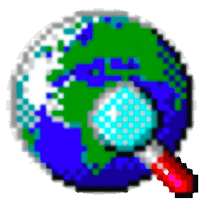

```{r setup, include=FALSE}
knitr::opts_chunk$set(echo = FALSE, message = FALSE, warning = FALSE, cache.lazy = FALSE)

```

```{r load_chart_styling, echo=FALSE}
#Page styling

#This is where you create your own custom color palette for the traces.
faulkner_colorway = c("#132C53","#F27A18","#ae0700","#79b473","#38726c","#76bed0","#6b2d5c","#448b2d","#e6d812")

faulkner_colorway_highlight_1 = c(
  "rgba(19, 44, 83, 1)",
  "rgba(242, 122, 24,.1)",
  "rgba(174, 7, 0,.05)",
  "rgba(121, 180, 115,.1)",
  "rgba(56, 114, 108,.1)",
  "rgba(118, 190, 208,.1)"
)

faulkner_colorway_highlight_2 = c(
  "rgba(19, 44, 83, .1)",
  "rgba(242, 122, 24,1)",
  "rgba(174, 7, 0,.05)",
  "rgba(121, 180, 115,.1)",
  "rgba(56, 114, 108,.1)",
  "rgba(118, 190, 208,.1)"
)

faulkner_colorway_highlight_3 = c(
  "rgba(19, 44, 83, .1)",
  "rgba(242, 122, 24,.1)",
  "rgba(174, 7, 0,1)",
  "rgba(121, 180, 115,.1)",
  "rgba(56, 114, 108,.1)",
  "rgba(118, 190, 208,.1)")

faulkner_colorway_bw = c("#999999", "#777777",	"#555555", "#333333",	
"#111111")

#This controls the background color for the entire chart. Probably best left white.
faulkner_paperbackground = c('rgba(255,255,255,0)')

#This controls the background for the plot. Probably best left white.
faulkner_plotcolor = c('rgba(255,255,255,.3)')

#Margin 

m <- list(l = 50, r = 50, b = 50, t = 50, pad = 4)

m_large <- list(l = 100, r = 100, b = 100, t = 100, pad = 4)

#Caption Style

fig_caption <- "font-family: 'Playfair Display','Helvetica Neue',Helvetica,Arial,sans-serif; font-weight: normal; font-size:90%"

plot_font <- list(family = "'Playfair Display','Helvetica Neue',Helvetica,Arial,sans-serif",
  size = 24,
  color = '#363636')
```

```{r load_libraries}
library(knitr)
library(shiny)
library(tidyverse)
library(plotly)
library(cooccur)
library(stats)
```

```{r load_data}
dy_events <- read_csv("data/full_database_2021_5_11.csv")

dy_events <-  dy_events %>% 
   mutate(reduced_race = ifelse(Race != "White" & Race != "Black" & Race != "Unknown", "Multiple Ancestries", Race)) %>% 
   mutate(reduced_race = ifelse(Race == "Indian", "Native American", reduced_race))
              

```

```{r load_spaces}
space <- read_csv("location_spaces.csv")
```

```{r get_location_data}
location_data <- read_csv("data/locations.csv")  
event_types <- read_csv("data/events.csv")
```

```{r set_location_types}
location_type <- location_data %>%
  mutate(LocationCode = paste(SourceTextCode, LocationKey, sep =
                                "")) %>%
  select(LocationCode, Type)
event_locations <- event_types %>%
  mutate(LocationCode = as.numeric(LocationCode)) %>%
  mutate(LocationCode = paste(SourceTextCode, LocationCode, sep =
                                "")) %>%
  select(c(Nid, LocationCode))

event_location_types <- event_locations %>%
  left_join(location_type) %>%
  rename(EventID = Nid)
```

```{r eval=FALSE}
location_export <- location_type %>% 
                    distinct(Type)

write_csv(location_export, "location_export.csv")
```

# Overview

-   Digital Humanities and Literary Studies
-   Digital Yoknapatawpha
-   Research: Literary Demography
-   Pathways to New Knowledges

# Navigation

-   You can use the arrow keys to navigate (←) left and right (→) between sections
-   Each section navigates up (↑) and down (↓)
-   Press ESC to see all the slides

# Digital Humanities and Literary Studies

Working definition

-   Any form of scholarship, teaching, or publication that uses a computational or digital approach to ask questions in the humanities that would be hard to answer using non-computational methods.

-   An opportunity for the humanities to complicate and question the way in which data is acquired, processed, and represented at a time when ways of knowing the world are increasingly digital.

## <iframe data-src="http://mappingdecline.lib.uiowa.edu/map/" data-preload width = 1600 title="Mapping Decline" alt="Website cannot be loaded" height = 950></iframe>

<div class = "citation">
Gordon, Colin. [Mapping Decline](http://mappingdecline.lib.uiowa.edu/map/). University of Iowa Libraries, 2009.</div>

## DH as Network

There is no "core" DH, but a series of related practices.

{height="700"}

## DH as Network-ish

Practices are markedly different from one another.

{height="700"}

## Knowledge Production

Universities have a self-sustaining cycle of knowledge production


::: {.container}
:::: {.col}

"So while digital technology is introducing new critical methods and procedures, it does not fundamentally alter the sociologics of scholarship and education nor their institutional mechanisms." 

::::: {.citation}

McGann, Jerome. *A New Republic of Letters: Memory and Scholarship in the Age of Digital Reproduction*. Harvard UP, 2014. p. 144.

:::::

::::
:::: {.col}
{width="800"}
::::
:::

## Digital Humanist Intervention

-   More open access to scholarship
-   Closer collaborations across and between institutions
-   Literary studies curriculum where teaching and research are indistinguishable from one another, and in which students become scholars from day 0.

# Digital Yoknapatawpha

-   **Teaching:** A means for students to become familiar with Faulkner's world
-   **Research:** A scholarly tool for investigating relationships across the corpus
-   **Publishing:** A publication platform for different scholarly insights based on the data

## Faulkner Mapping

In 1936 and 1945 Faulkner drew two different maps of his famous Yoknapatawpha county.

::: two_image
```{r 1936map, out.height= 550, fig.cap = "William Faulkner, <i>Absalom, Absalom!</i> (New York: Random House, 1936). Albert and Shirley Small Special Collections, University of Virginia Library, Charlottesville, VA"}
knitr::include_graphics("http://faulkner.iath.virginia.edu/media/resources/MANUSCRIPTS/AAMapOpen.jpg")
```

```{r 1945map, out.height = 550, fig.cap = "<i>The Portable Faulkner</i>. PS3511 .A86 A6 1946. Special Collections, University of Virginia, Charlottesville, VA"}
knitr::include_graphics("http://faulkner.iath.virginia.edu/media/resources/MANUSCRIPTS/PortableMap.jpg")
```
:::

## Mapping Faulkner

The goal of the project was to be as comprehensive as possible.

-   5011 Characters
-   2176 Locations
-   8520 Events

## <iframe data-src="http://faulkner.iath.virginia.edu/" data-preload width = 1600 height = 950></iframe>  


<div class = "citation">
Railton, Steven, et al. [Digital Yoknapatawpha](http://faulkner.iath.virginia.edu/). University of Virginia, 2022.</div>

# Research: Literary Demography

The corpus represents an ecosystem

```{r all_character_data}
all_characters <- dy_events %>% 
                  select(CharacterName, Race, Class, Gender, X, Y, LocationTitle) %>% 
                  mutate(Y = Y*-1) %>% 
                  mutate(X = X-632) %>% 
                  distinct(CharacterName, .keep_all = TRUE)
```

```{r eco_system_map}
image_file <- "https://raw.githubusercontent.com/joostburgers/absalom_sentiment_analysis/master/images/dy_base_layer_4_2.png"

fig_char_map <-
  plot_ly(
    all_characters,
    x = ~ X,
    y = ~ Y,
    name = "Characters",
    #  colors = faulkner_colorway,
    type = 'scatter',
    mode = 'markers',
     hoverinfo='text',
    text= ~paste('Name:', CharacterName,'<br>Race: ',Race, '<br>Gender: ', Gender, '<br>Class: ', Class),
     marker = list(
        sizemode='diameter',
        size = 6, 
                  opacity = .4,
                  line = list(width = 1, color = 'white')
          ),
    width = 900,
     height = 705
   
  )
fig_char_map <- fig_char_map %>%
  layout(
    title = "All Characters",
    xaxis = list(
      title = "",
      visible = FALSE,
      fixedrange = TRUE,
      range = c(0, 2008)
    ),
    yaxis = list(
      title = "",
      visible = FALSE,
      fixedrange = TRUE,
      range = c(-1660, 0)
    ),
    margin = m,
    font = plot_font,
    legend = list(
      title = list(text = "<b>Legend</b>"),
      itemsizing = 'constant'
    ),
    autosize = F,
      paper_bgcolor = faulkner_paperbackground,
    plot_bgcolor = faulkner_plotcolor,
    modebar = list(bgcolor = faulkner_paperbackground),
    images = list(
      list(
        source =  image_file,
        xref = "x",
        yref = "y",
        x = 0,
        y = -40,
        sizex = 2008,
        sizey = 1660,
         sizing = "stretch",
        opacity = 0.8,
        layer = "below"
      )
      )
  )

tags$div(fig_char_map, class = "map_container r-stretch", align = "center")
#tags$caption(HTML("<i>Figure 2:</i> Map of each character."), style =fig_caption)
```

## Racial Distribution

Characters can be grouped together by a common attribute to determine the distribution in the population

```{r dy_characters, cache=TRUE}
dy_raw_characters <- dy_events %>% 
    distinct (SourceTextCode, CharacterName, reduced_race) %>% 
              count(reduced_race) %>% 
              mutate(percent = round(n/sum(n),2))
```

```{r plot_dy_characters}
plot_demography <-dy_raw_characters %>%  
                  plot_ly(
      values =  ~dy_raw_characters$n,
    labels = ~ dy_raw_characters$reduced_race,
    type = 'pie',
    name = "Character Count",
    text = paste(dy_raw_characters$reduced_race, dy_raw_characters$percent*100, "%"),
    textinfo = 'text',
    textposition = "inside",
    hovertemplate = paste("Total", dy_raw_characters$reduced_race,"characters:", dy_raw_characters$n,
    '<extra></extra>'),
    height = 700
      )
plot_demography <- plot_demography %>% layout(
    title = "Character Demography",
    showlegend = FALSE,
    colorway = faulkner_colorway,
    font = plot_font,
    margin = m_large,
    autosize = F,
    #height = 800,
    #width = 768,
    paper_bgcolor = faulkner_paperbackground,
    plot_bgcolor = faulkner_plotcolor,
     modebar = list(bgcolor= faulkner_paperbackground)
     )


#plot_demography
tags$div(plot_demography, class = "map_container fragment", align = "center")
```

<p class = "fragment">But this is misleading, because not all characters appear equally...</p>

## Character Representation

The number of times characters occur in events is a proxy for appearances.

```{r character_count, cache=TRUE}
dy_events_characters <- dy_events %>%
  filter(PresentMentioned == "Present") %>%
  filter(IndividualGroup == "Individual") %>%
  count(reduced_race) %>%
  mutate(percent = n / sum(n))
```

```{r sunburst_data, cache=TRUE}
#Get totals for each step of the sunburst
sunburst_filter <- dy_events %>% 
                  filter(PresentMentioned == "Present") %>%
  filter(IndividualGroup == "Individual") %>%
  filter(Gender != "Multi Gender Group") 

total <-  sunburst_filter %>%
  count(CharacterName, "values") %>%
  summarise(values = sum(n)) %>%
  mutate(labels = "Total", .before = 1)

races <- sunburst_filter %>%
  count(reduced_race, name = "values") %>%
  rename(labels = reduced_race) %>%
  mutate(parents = total$labels) %>%
  mutate(ids = paste(parents, " - ", labels, sep = ""))

genders <- sunburst_filter %>%
  group_by(Gender) %>%
  count(reduced_race, name = "values") %>%
  rename(labels = Gender) %>%
  arrange(labels) %>%
  mutate(parents = paste(total$labels, " - ", reduced_race, sep =
                           "")) %>%
  mutate(ids = paste(parents, " - ", labels, sep = "")) %>%
  ungroup() %>%
  group_by(parents) %>%
  arrange(desc(values), .by_group = TRUE) %>%
  select(-reduced_race)

characters <- sunburst_filter %>%
  group_by(reduced_race, Gender) %>%
  count(CharacterName, name = "values") %>%
  top_n(10) %>%
  rename(labels = CharacterName) %>%
  mutate(parents = paste("Total - ", reduced_race, " - ", Gender, sep =
                           "")) %>%
  mutate(ids = paste(parents, " - ", labels, sep = ""))  %>%
  ungroup() %>%
  select(labels:ids) %>%
  group_by(parents) %>%
  arrange(desc(values), .by_group = TRUE)

sunburst <- total %>%
  bind_rows(races) %>%
  bind_rows(genders) %>%
  bind_rows(characters)
```

```{r plot_sunburst, cache=TRUE}
demography_sunburst <-
  plot_ly(
    labels = sunburst$labels,
    parents = sunburst$parents,
    values = sunburst$values,
    ids = sunburst$ids,
    type = 'sunburst',
    hovertemplate = paste(
      round((sunburst$values / total$values[1]) * 100, 0),
      "% Present",
      "<extra>Total appearances: ",
      sunburst$values,
      "</extra>",
      sep = ""
    ),
    branchvalues = 'total',
    height = 700
  )

demography_sunburst <- demography_sunburst %>%
  add_annotations(
    x = 0,
    y = 1,
    xref = 'paper',
    yref = 'paper',
    showarrow = FALSE,
    text = c("Click on the pie pieces to view individual charts"),
    font = list(size = 18)
  )

demography_sunburst <- demography_sunburst %>%
  layout(
    title = "Character Presence in all Events",
    showlegend = FALSE,
    colorway = c(
      "#132C53",
      "#ae0700",
      "#F27A18",
      "#79b473",
      "#38726c",
      "#76bed0",
      "#6b2d5c",
      "#448b2d",
      "#e6d812"
    ),
    #The colorway had to be reversed to account for Plotly taking the higher value to match the colorway.
    font = plot_font,
    margin = list(l = 50, r = 50, b = 50, t = 80, pad = 4),
    paper_bgcolor = faulkner_paperbackground,
    plot_bgcolor = faulkner_plotcolor,
    modebar = list(bgcolor = faulkner_paperbackground)
  )


tags$div(demography_sunburst, class = "map_container fragment", align = "center")
```

<p class = "fragment">White Male characters are over-represented.</p>

## Character Interaction

<p class = "fragment">Characters do not simply appear in the corpus at random they follow a plot.</p>

<p class = "fragment">
"How are [a character’s] appearances positioned in relation to other characters and to the thematic and structural totality of the narrative? Why does a particular character suddenly disappear from the narrative or abruptly begin to gain more narrative attention?" </p>

<p class = "fragment citation"> Woloch, Alex. *The One Vs. The Many: Minor Characters and the Space of the Protagonist in the Novel.* Princeton University Press, 2009.</p>


## Characters as Types

- Determining how characters interact requires knowing more details about them
- Character attributes (Race, Gender) can be strung together to create "types" (i.e. White Male, Black Female, etc.)
```{r race_gender_co_occurrence}
race_gender_matrix <- dy_events %>%
  filter(PresentMentioned == "Present") %>%
  filter(IndividualGroup == "Individual") %>%
  filter(Gender != "Multi Gender Group") %>%
  
  select(EventID, reduced_race, Gender) %>%
  mutate (race_gender = paste(reduced_race, Gender, sep = "_"))  %>%
  group_by(EventID) %>%
  add_count(EventID) %>%
  filter(n == 2) %>%
  mutate(n = 1) %>%
  filter(race_gender %in% c("Black_Male", "White_Male", "Black_Female", "White_Female")) %>%
  pivot_wider(
    names_from = race_gender,
    values_from = n,
    values_fill = 0,
    values_fn = sum
  )  %>%
  select(!(reduced_race:Gender))  %>%
  pivot_longer(2:5) %>%
  filter(value > 0) %>%
  group_by(EventID) %>%
  arrange(name, .by_group = TRUE)  %>%
  mutate(intersection = ifelse(value < 2, paste0(name, collapse = "."), paste(name, name, sep = "."))) %>%
  separate(intersection, c("word1", "word2"), "\\.") %>%
  mutate(intersection = ifelse(
    word1 < word2,
    paste(word1, "<br>", word2, sep = ""),
    paste(word2, "<br>", word1, sep = "")
  )) %>%
  ungroup() %>%
  count(intersection) %>%
  mutate(intersection = str_replace_all(intersection, "_", " ")) %>%
  drop_na() %>%
  arrange(n)
```

```{r plot_race}
race_gender_matrix_plot <- plot_ly(
  race_gender_matrix,
  x = ~ intersection,
  y = ~ n,
  type = "bar",
  opacity = .9,
  colors = faulkner_colorway[1],
  hovertemplate = paste('Count: %{y}<extra></extra>'),
  height = 600
)

race_gender_matrix_plot <- race_gender_matrix_plot %>%
  layout(
    font = plot_font,
    title = "Two Types of Characters are Alone Together",
    xaxis = list(title = "Interaction", categoryorder = "total ascending"),
    yaxis = list(title = "Number of Events"),
    paper_bgcolor = faulkner_paperbackground,
    plot_bgcolor = faulkner_plotcolor,
    margin = m <- list(l = 50, r = 50, b = 50, t = 100, pad = 4),
    modebar = list(bgcolor = faulkner_paperbackground)
  )

tags$div(race_gender_matrix_plot, class = "map_container fragment", align = "center")
```


## Birds of a feather...

* In statistical ecology, co-occurrence analysis is the process of determining the rules of assembly.
  + If there is a **positive** co-occurrence then one bird appears with another.
  + If there is a **negative** co-occurrence then one bird does not appear when another is present.
  + Co-occurrence can also be **random**, where a bird may appear sometimes and at other times not.

## ...do math!{data-background-transition="none"}

::: nonincremental

* Probabilistic statistics
   $$
    P_j = \frac{\binom{N_1}{j}\times\binom{N-N_1}{N_2-j}}{\binom{N}{N_2}}
    $$
  + All the different combinations of "species 1" at all sites $\binom{N_1}{j}$
  + Multiply the different combinations possible with "species 2" without "species 1"$\binom{N-N_1}{N_2-j}$
  + Divide by the total number of sites where "species 2" could have occurred. $\binom{N}{N_2}$

<div class= "citation">Veech, Joseph. "cooccur: Probabilistic Species Co-Occurrence Analysis in R." *Journal of Statistical Software*. vol. 69. 2/2016</div>
:::

## Social Relations and Segregation

- Types tend to reproduce the social relationships of the Planter Aristocracy and Jim Crow


```{r co_occurrence_matrix, eval = FALSE, cache = TRUE}
co_occurrence_matrix <- dy_events %>% 
  filter(PresentMentioned == "Present") %>%
  filter(IndividualGroup == "Individual") %>%
  filter(Gender != "Multi Gender Group") %>%
    select(EventID, reduced_race, Gender, Class) %>% 
    mutate (Class = ifelse(Class == "Indian Chief", "Indian_Tribal_Leader", Class)) %>% 
      mutate(Class = ifelse(Class == "Yeoman", "Middle Class",Class)) %>%
      mutate(Class = ifelse(Class == "Enslaved Black", "Enslaved", Class)) %>% 
      mutate(Class = ifelse(Class == "Free Black", "Free", Class)) %>% 
      mutate(Class = ifelse (reduced_race == "Black" & Class !="Enslaved","Free", Class)) %>% 
    mutate (race_gender_class = paste(reduced_race,Gender, Class, sep = "_"))  %>% 
 select(!(reduced_race:Class))  %>%
  group_by(EventID) %>%
  count(race_gender_class) %>% 
  mutate(n = ifelse (n > 0, 1, 0)) %>% 
  pivot_wider(names_from = EventID,
              values_from = n,
              values_fill = 0)  %>% 
  column_to_rownames(var = "race_gender_class")
```

```{r, cache=TRUE, eval=FALSE}
race_class_gender_cooccur <-
  cooccur(
    mat = co_occurrence_matrix,
    type = "spp_site",
    thresh = FALSE,
    spp_names = TRUE,
    true_rand_classifier = 0.1,
    prob = "comb",
    site_mask = NULL,
    only_effects = FALSE,
    eff_standard = FALSE,
    eff_matrix = FALSE
  )


```


```{r get_cooccur_table}

#cooccur_table_fresh <- prob.table(race_class_gender_cooccur)

#write_csv(cooccur_table_fresh, "data/cooccur_table_backup.csv")
cooccur_table <- read_csv("data/cooccur_table_backup.csv")


#pair_table <- pair.attributes(race_class_gender_cooccur)
#pair.profile(race_class_gender_cooccur)
```

```{r top_cooccur}
tagged_prob_table <- cooccur_table %>%
  mutate(
    relationship = case_when(
      p_lt < .05 ~ "Negative",
      p_lt > .05 & p_lt < .95 ~ "Random",
      p_lt > .95 ~ "Positive"
    )
  ) %>%
  arrange(sp1_name, sp2_name) %>%
  mutate(intersection = ifelse(
    sp1_name < sp2_name,
    paste(sp1_name, sp2_name, sep = "."),
    paste(sp2_name, sp1_name, sep = ".")
  ))

top_table <- tagged_prob_table %>%
  filter(relationship != "Random") %>%
  group_by(relationship) %>%
  top_n(obs_cooccur, n = 5) %>%
  mutate(intersection = str_replace_all(intersection, c("_" =
                                                          " ", "\\." = "<br>"))) %>%
  ungroup() %>%
  arrange(relationship, obs_cooccur)
```

```{r top_coccur_plot}
top_table_plot <- plot_ly(
  top_table,
  x = ~ intersection,
  y = ~ obs_cooccur,
  type = "bar",
  color = ~relationship, 
  name = ~relationship,
  opacity=.9,
  colors= faulkner_colorway,
  hovertemplate=paste("Observed Co-Occurrence: %{y}<br>", "Expected Co-Occurrence:", round(top_table$exp_cooccur,0), "<extra></extra>"),
  height = 600
 )

top_table_plot <- top_table_plot %>%
  layout(
    font = plot_font,
    title = "Top 5 Positive and Negative Co-Occurrence",
    xaxis = list(title = "Interaction", categoryorder = "trace"),
    yaxis = list(title = "Number of Events"),
    paper_bgcolor = faulkner_paperbackground,
    plot_bgcolor = faulkner_plotcolor,
    modebar = list(bgcolor = faulkner_paperbackground),
    margin = m
  )

top_table_plot <- top_table_plot %>% 
            config(displayModeBar = FALSE)

tags$div(top_table_plot, class = "map_container fragment", align = "center")
```

## Interactions are Place Specific

Characters do not merely interact, they do so in particular contexts.

There are **31** character types that combine in **528** different ways across **14** different types of locations. Figuring out these relationships becomes very complicated.

<h1 class = "fragment"> Data science to the rescue!</h1>

## Principal Component Analysis

Principal Component Analysis is a useful technique to reduce the number of dimensions in a data set.

It calculates which components account for the most variance in the data.

```{r place_matrix}
# place_matrix <- dy_events %>%
#   filter(PresentMentioned == "Present") %>%
#   filter(IndividualGroup == "Individual") %>%
#   filter(Gender != "Multi Gender Group") %>%
#   select(EventID, reduced_race, Gender, Class) %>%
#   mutate(Class = ifelse(Class == "Indian Chief", "Indian_Tribal_Leader", Class)) %>%
#   mutate(Class = ifelse(Class == "Yeoman", "Middle Class", Class)) %>%
#   mutate (race_gender_class = paste(reduced_race, Gender, Class, sep = "_")) %>%
#   group_by(EventID) %>%
#   add_count(EventID) %>%
#   filter(n == 2) %>%
#   mutate(n = 1) %>%
#   pivot_wider(
#     names_from = race_gender_class,
#     values_from = n,
#     values_fill = 0,
#     values_fn = sum
#   )  %>%
#   select(!(reduced_race:Class))
```

```{r place_characters}
# place_characters <- place_matrix %>%
#   pivot_longer(2:9) %>%
#   filter(value > 0) %>%
#   group_by(EventID) %>%
#   arrange(name, .by_group = TRUE) %>%
#   mutate(intersection = ifelse(value < 2, paste0(name, collapse = "."), paste(name, name, sep = ".")))  %>%
#   left_join(event_location_types)  %>%
#   group_by(Type) %>%
#   count(intersection) %>%
#   pivot_wider(names_from = Type,
#               values_from = n,
#               values_fill = 0)
```

```{r}
co_occurrence_locations <- dy_events %>%
  filter(PresentMentioned == "Present") %>%
  filter(IndividualGroup == "Individual") %>%
  filter(Gender != "Multi Gender Group") %>%
  select(EventID, reduced_race, Gender, Class) %>%
  mutate (Class = ifelse(Class == "Indian Chief", "Indian_Tribal_Leader", Class)) %>%
  mutate(Class = ifelse(Class == "Yeoman", "Middle Class", Class)) %>%
  mutate(Class = ifelse(Class == "Enslaved Black", "Enslaved", Class)) %>%
  mutate(Class = ifelse(Class == "Free Black", "Free", Class)) %>%
  mutate(Class = ifelse (reduced_race == "Black" &
                           Class != "Enslaved", "Free", Class)) %>%
  mutate (race_gender_class = paste(reduced_race, Gender, Class, sep = "_"))  %>%
  select(!(reduced_race:Class))  %>%
  group_by(EventID) %>%
  count(race_gender_class) %>%
  add_count(EventID, name = "event_nr") %>%
  filter(event_nr > 1) %>%
  mutate(n = ifelse (n > 0, 1, 0)) %>%
  group_by(EventID) %>%
  summarise(out = list(
    combn(
      race_gender_class,
      2,
      FUN = function(x)
        tibble(word1 = x[1], word2 = x[2]),
      simplify = FALSE
    )
  )) %>%
  unnest %>%
  unnest %>%
  mutate(intersection = paste(word1, word2, sep = ".")) %>%
  select(EventID, intersection)
```

```{r}
co_occurrence_types <- co_occurrence_locations %>%
  left_join(event_location_types) %>%
  group_by(Type) %>%
  count(intersection) %>%
  pivot_wider(names_from = Type,
              values_from = n,
              values_fill = 0) %>%
  select(-"NA")
```

```{r}
# tagged_prob_table <- cooccur_table %>% 
#                      mutate(relationship = case_when(
#                        p_lt < .05 ~"Negative",
#                        p_lt > .05 & p_lt <.95 ~"Random",
#                        p_lt > .95 ~"Positive"
#                      )) %>% 
#                     arrange(sp1_name, sp2_name) %>% 
#                     mutate(intersection = ifelse(sp1_name<sp2_name, paste(sp1_name, sp2_name, sep="."),paste(sp2_name, sp1_name, sep=".") ) )
```

```{r interaction_tags}
interaction_tags <- tagged_prob_table %>% 
                    select(relationship, intersection)
```

```{r tagged_types}
tagged_types <- co_occurrence_types %>% 
                left_join(interaction_tags) %>% 
                relocate(relationship, .before = 1) 
        
```

```{r pca_plot}
hover_data <- tagged_types %>%
  mutate(intersection = str_replace_all(intersection, "_", " ")) %>%
  separate(intersection, c("character1", "character2"), "\\.") %>%
  rowwise() %>%
  mutate(total = sum(Cabin:YoknapatawphaInset)) %>%
  select(character1, character2, total)

X <- subset(tagged_types, select = -c(relationship:intersection))
prin_comp <- prcomp(X, rank = 2)
components <- prin_comp[["x"]]
components <- data.frame(components)
components <- cbind(components, co_occurrence_types$intersection)
components$PC2 <- -components$PC2
explained_variance <- summary(prin_comp)[["sdev"]]
explained_variance <- explained_variance[1:2]
comp <- prin_comp[["rotation"]]
comp[,'PC2'] <- - comp[,'PC2']
loadings <- comp
for (i in seq(explained_variance)){
  loadings[,i] <- comp[,i] * explained_variance[i]
}

features = tagged_types %>% 
           pivot_longer(3:14) %>% 
           distinct(name)
features = features$name

plot_pca <-
  plot_ly(
    components,
    x = ~ PC1,
    y = ~ PC2,
    color = ~ tagged_types$relationship,
    colors = faulkner_colorway[2:6],
     hovertemplate = paste("Character 1:", hover_data$character1,"<br>Character 2:", hover_data$character2, "<extra>Total interactions:<br>",hover_data$total,"</extra>"),
    #hovertext = tagged_types$intersection,
    type = 'scatter',
    mode = 'markers',
    width = 1000,
    height = 600
  ) %>%
  layout(
    title = list(text = 'PCA Character Interaction by Location var='),
    legend = list(title = list(text = 'Co-occurrence')),
    xaxis = list(title = "0"),
    yaxis = list(title = "1"),
    showlegend = TRUE,
    paper_bgcolor = faulkner_paperbackground,
    plot_bgcolor = faulkner_plotcolor,
     margin = m,
    font = list(family = "'Playfair Display','Helvetica Neue',Helvetica,Arial,sans-serif",
  size = 16, color = '#363636'),
    modebar = list(bgcolor = faulkner_paperbackground)
  )

for (i in seq(12)) {
 plot_pca <- plot_pca %>%
    add_segments(
      x = 0,
      xend = loadings[i, 1],
      y = 0,
      yend = loadings[i, 2],
      line = list(color = 'black'),
      inherit = FALSE,
      showlegend = FALSE
    ) %>%
    add_annotations(
      x = loadings[i, 1],
      y = loadings[i, 2],
      ax = 0,
      ay = 0,
      text = features[i],
      xanchor = 'center',
      yanchor = 'bottom'
    )
}

tags$div(plot_pca, class = "map_container fragment", align = "center")
```


## Mapping Character Interaction

- The basic insight from the PCA can be mapped back into the DY map in a more simplified form.

```{r co_occurrence_simplified}
co_occurrence_simplified <- dy_events %>%
  filter(PresentMentioned == "Present") %>%
  filter(IndividualGroup == "Individual") %>%
  filter(Gender != "Multi Gender Group") %>%
  select(EventID, reduced_race, Gender) %>%
  filter(reduced_race == c("Black", "White")) %>%
  mutate (race_gender = paste(reduced_race, Gender, sep = "_"))  %>%
  select(!(reduced_race:Gender))  %>%
  group_by(EventID) %>%
  count(race_gender) %>%
  add_count(EventID, name = "event_nr") %>%
  filter(event_nr > 1) %>%
  mutate(n = ifelse (n > 0, 1, 0)) %>%
  group_by(EventID) %>%
  summarise(out = list(combn(
    race_gender,
    2,
    FUN = function(x)
      tibble(word1 = x[1], word2 = x[2]),
    simplify = FALSE
  ))) %>%
  unnest %>%
  unnest %>%
  mutate(intersection = paste(word1, word2, sep = ".")) %>%
  select(EventID, intersection) %>%
  group_by(EventID) %>%
  count(intersection)
```

```{r create_race_interaction}
#get location information
dy_coordinates <- dy_events %>%
  mutate(X = ifelse(is.na(`True X`), X, `True X`)) %>%
  mutate(Y = ifelse(is.na(`True Y`), Y, `True Y`)) %>%
  mutate(X = X - 632) %>%
  mutate(new_y = Y * -1) %>%
  select(EventID, X, Y, new_y, LocationTitle, LocationID)


co_occurrence_mapped <- co_occurrence_simplified %>%
  left_join(dy_coordinates) %>%
  left_join(event_location_types) %>%
  left_join(space) %>%
  select(-n)

co_occurrence_xy <- co_occurrence_mapped %>%
  group_by(LocationTitle, intersection) %>%
  add_count(LocationTitle) %>%
  distinct(intersection, .keep_all = TRUE) %>%
  ungroup() %>%
  group_by(LocationTitle) %>%
  mutate(transformed_y = round(mean(Y), 0) * -1) %>%
  mutate(transformed_x = round(mean(X), 0)) %>%
  select(!(LocationID:Type)) %>%
  group_by(Space) %>%
  arrange(desc(n), .by_group = TRUE)

co_occurence_race_groups <- co_occurrence_xy %>%
  separate(
    intersection,
    into = c("race1", "gender1", "race2", "gender2"),
    sep = "[_\\.]"
  ) %>%
  ungroup() %>%
  mutate(
    difference = case_when(
      race1 != race2 &
        gender1 != gender2 ~ "Different race<br>Different gender",
      race1 == race2 &
        gender1 != gender2 ~ "Same race<br>Different gender",
      race1 != race2 &
        gender1 == gender2 ~ "Different race<br>Same gender"
    )
  ) %>%
  mutate (
    LocationTitle = ifelse(
      str_detect(LocationTitle, "Compson") == TRUE &
        Space == "Plantation",
      "Compson Place",
      LocationTitle
    )
  ) %>%
  group_by(LocationTitle) %>%
  mutate(transformed_x = round(mean(transformed_x), 0),
         transformed_y = round(mean(transformed_y), 0)) %>%
  group_by(difference, transformed_x, transformed_y, LocationTitle, Space) %>%
  summarise(n = sum(n)) %>%
  group_by(LocationTitle) %>%
  arrange(difference, desc(n), .group_by = TRUE)
```

```{r out.width="768px",  out.height="605px", eval = FALSE}
# image_file <- "https://raw.githubusercontent.com/joostburgers/absalom_sentiment_analysis/master/images/dy_base_layer_4_2.png"
# 
# fig_cooccur_map <-
#   plot_ly(
#     co_occurrence_xy,
#     x = ~ transformed_x,
#     y = ~ transformed_y,
#     frame = ~Space,
#     name=~str_replace_all(intersection, c("_" = " ", "\\."= "<br>")),
#     color=~intersection,
#     type = 'scatter',
#     mode = 'markers',
#       size = ~n,
#       fill = ~"",
#        hoverinfo='text',
#     text= ~paste('Count:', n,'<br>',LocationTitle),
#      marker = list(
#         sizemode='diameter',
#         sizeref = 2, 
#                   opacity = .4,
#                   line = list(width = 1, color = 'white')
#           ),
#      width = 768,
#       height = 605
#    
#   )
# fig_cooccur_map <- fig_cooccur_map %>%
#   layout(
#     title = "Race and Gender Co-Occurrence by Location Type",
#     xaxis = list(
#       title = "",
#       visible = FALSE,
#       fixedrange = TRUE,
#       range = c(0, 2008)
#     ),
#     yaxis = list(
#       title = "",
#       visible = FALSE,
#       fixedrange = TRUE,
#       range = c(-1660, 0)
#     ),
#     margin = m,
#     font = plot_font,
#     legend = list(
#       title = list(text = "<b>Co-Occurrence Type</b>"),
#       itemsizing = 'constant'
#     ),
#     autosize = F,
#       
#     images = list(
#       list(
#         source =  image_file,
#         xref = "x",
#         yref = "y",
#         x = 0,
#         y = -40,
#         sizex = 2008,
#         sizey = 1660,
#          sizing = "stretch",
#         opacity = 0.8,
#         layer = "below"
#       )
#       )
#   )
# 
# fig_cooccur_map <- fig_cooccur_map %>% animation_opts(
#     1000, easing = "linear-out", redraw = FALSE
#   )
# 

#fig_cooccur_map 
#tags$h6(HTML("<i>Figure 9:</i> Map of where each racial word appears in the text by location."), style =fig_caption)
#tags$br()
```

```{r map_groups, cache=TRUE}
image_file <-
  "https://raw.githubusercontent.com/joostburgers/absalom_sentiment_analysis/master/images/dy_base_layer_4_2.png"

fig_cooccur_map_groups <-
  plot_ly(
    co_occurence_race_groups,
    x = ~ transformed_x,
    y = ~ transformed_y,
    frame = ~ Space,
    name =  ~ difference,
    color =  ~ difference,
    type = 'scatter',
    mode = 'markers',
    size = ~ n,
    fill = ~ "",
    hoverinfo = 'text',
    text = ~ paste('Count:', n, '<br>', LocationTitle),
    marker = list(
      sizemode = 'diameter',
      sizeref = 1,
      opacity = .7,
      line = list(width = 1, color = 'white')
    ),
    width = 1200,
    height = 800
    
  )
fig_cooccur_map_groups <- fig_cooccur_map_groups %>%
  layout(
    title = "Race and Gender Co-Occurrence by Location Type",
    xaxis = list(
      title = "",
      visible = FALSE,
      fixedrange = TRUE,
      range = c(0, 2008)
    ),
    yaxis = list(
      title = "",
      visible = FALSE,
      fixedrange = TRUE,
      range = c(-1660, 0)
    ),
    margin = m,
    font = plot_font,
    paper_bgcolor = faulkner_paperbackground,
    plot_bgcolor = faulkner_plotcolor,
    modebar = list(bgcolor = faulkner_paperbackground),
    legend = list(
      title = list(text = "<b>Co-Occurrence Type</b>"),
      itemsizing = 'constant'
    ),
    autosize = F,
    images = list(
      list(
        source =  image_file,
        xref = "x",
        yref = "y",
        x = 0,
        y = -40,
        sizex = 2008,
        sizey = 1660,
        sizing = "stretch",
        opacity = 0.8,
        layer = "below"
      )
    )
  )

fig_cooccur_map_groups <- fig_cooccur_map_groups %>% animation_opts(1000, easing = "circle-in-out", redraw = FALSE)

tags$div(fig_cooccur_map_groups, class = "map_container fragment", align = "center")

```

## Implications

- Faulkner reproduces the logic of Jim Crow, but does this represent the limits of his imagination or the beginning of the plot?

- What is the function of "background" characters? Do they "exist" or are they really just part of the setting?

- What does it mean for the reader when the social world is represented continously in one way throughout a work of fiction?

## Great!

- But now what?
- Where does this go?
<p class = "fragment convex">{width="800"}</p>

# Pathways to New Knowledges

Create multiple on-ramps
<div class="r-stack">
 
 
  
  
  <video class="fragment fade-in-then-out" data-fragment-index="5" data-autoplay controls loop src="video/Racial_Distribution_by_Event_Chronology_revised.mp4" height="350"></video>
    
</div>


## Institutionalizing New Knowledges

<div class="r-stack">
<p class = "fragment" data-fragment-index="0">Back to the text</p>
 
  
  </div>

## Teaching New Knowledges

<iframe data-src="http://faulkner.iath.virginia.edu/family/videos-burgersre.php" data-preload width = 1600 height = 800></iframe>

## Teaching and Learning William Faulkner in the Digital Age

* 30-month grant
* 10 instructors from high schools, community colleges, and research institutions
* Develop interactive learning modules using Digital Yoknapatawpha
* Create signature pairings with other authors
  + Faulkner and Hurston
  + Faulkner and Hemingway
  + Faulkner and Baldwin
  + Faulkner and Morrison
* The digital and the analog as mutually enriching ways of looking at the world
  
## Thank you!

Follow us!

<p><a href="https://twitter.com/DigYok">\@DigYok</a><br>
 <a href="https://www.instagram.com/digyok/">digyok</a><br>
 <a href="https://www.facebook.com/digyok">Digital Yoknapatawpha</a><br>
 <a href="http://faulkner.iath.virginia.edu/">http://faulkner.iath.virginia.edu</a><br>
</p>

